<div align="center">
  <h1>useRefEffect</h1>
  <br/>
  A lightweight wrapper for React's ref callbacks with cleanup functionality.
  <br/>
    <a href="https://www.npmjs.com/package/react-use-ref-effect">
      
    </a>
    <a href='https://github.com/jantimon/react-use-ref-effect/workflows/CI?query=workflow%3A"CI"'>
       
    </a>
    <br/>
    
    
</div>

---

Executes an effect directly after React attaches a ref to a DOM node and provides cleanup functionality when React detaches the DOM node from the ref.

- The hook does __not__ trigger additional renderings.
- Lightweight: ~500B minified and brotlied.

## Version 2.0.0 Update

React 19 adds cleanup functions for ref callbacks, so users should consider useing `useCallback` directly instead of the `react-use-ref-effect` package.  

# API

## useRefEffect API
Use case: every time you need to react to ref changes with optional cleanup

- `const ref = useRefEffect(callback)` - calls the provided `callback` when the ref is changed.

- `const ref = useRefEffect(callback, [])` - calls the provided `callback` when the ref is changed or a dependency is changed - similar to useEffect.

- `const ref = useRefEffect((element) => { return cleanupCallback }, [])` - calls the provided `cleanupCallback` once the component unmounts or when React removes the referenced DOM element.

```js
import { useRefEffect } from 'react-use-ref-effect';

const Component = () => {
  const ref = useRefEffect((element) => {
    console.log('Element', element, 'is now available');
    return () => {
      console.log('Element', element, 'is no longer available');
    }
  }, []);

  return <div ref={ref}>Hello World</div>
}
```

## useMergeRefs API
Use case: when you need to apply multiple refs to a single DOM element

- `const mergedRef = useMergeRefs(ref1, ref2, ...)` - combines multiple refs into a single ref callback that applies all of them to the same element.
- Works with `useRef()`, `useRefEffect()`, callback refs, and any combination of these.
- All cleanup functions from the individual refs are properly called when the element is unmounted or detached.
- Only refs that actually change are re-invoked - stable refs are not affected by unstable ones.
- Callback refs without a cleanup function are called with `null` on unmount.

> [!WARNING]
> Most ref merging implementations have a subtle bug: **when *any* ref changes, *all* refs get re-invoked**! This breaks React's contract - stable refs should only be called once on mount and once on unmount.

`useMergeRefs` tracks each ref independently. Notice in the following chart the step 2: when **Ref B** changes, **Ref A stays** unchanged - it doesn't get a spurious cleanup/init cycle. Naive implementations would call cleanup and init on *both* refs, breaking event listeners, animations, or other stateful logic in Ref A:

```mermaid
flowchart TB
    subgraph T1 ["1: Mount"]
        direction LR
        N1["🟢 Node created"]
        A1["🟢 Ref A: init(node)"]
        B1["🟢 Ref B: init(node)"]
    end

    subgraph T2 ["2: Rerender (Ref B change)"]
        direction LR
        N2["⚪ Node unchanged"]
        A2["⚪ Ref A: unchanged"]
        B2["🔴 Ref B: cleanup() 
        🟢 Ref B': init(node)"]
    end

    subgraph T3 ["3: Unmount"]
        direction LR
        N4["🔴 Node removed"]
        A3["🔴 Ref A: cleanup()"]
        B4["🔴 Ref B': cleanup()"]
    end

    T1 --> T2 --> T3
```



```js
import { useRefEffect, useMergeRefs } from 'react-use-ref-effect';

const Component = () => {
  // A ref for focus management
  const focusRef = useRefEffect((element) => {
    element.focus();
    return () => {
      console.log('Focus element unmounted');
    }
  }, []);

  // A ref for event listeners
  const eventRef = useRefEffect((element) => {
    const clickHandler = () => console.log('Element clicked');
    element.addEventListener('click', clickHandler);
    return () => {
      element.removeEventListener('click', clickHandler);
    }
  }, []);

  // Combine both refs into one
  const mergedRef = useMergeRefs(focusRef, eventRef);

  return <input ref={mergedRef} placeholder="I'll be focused and have a click handler" />
}
```

# React 19 Compatibility

React 19 added native support for cleanup functions in ref callbacks. This package now leverages this feature to provide a simpler implementation while maintaining the same API.

If you're using React 19, you could achieve similar functionality with:

```js
import { useCallback } from 'react';

const Component = () => {
  const ref = useCallback((element) => {
    if (element) {
      console.log('Element', element, 'is now available');
      return () => {
        console.log('Element', element, 'is no longer available');
      }
    }
  }, []);

  return <div ref={ref}>Hello World</div>
}
```

This package provides a convenient wrapper around this pattern with dependency tracking.

# Motivation

React provides two powerful hooks: `useRef` and `useEffect`.  
However before React 19, they didn't work perfectly in combination when dealing with conditional rendering:

```js
// ⚠️ Pre-React 19 approach with issues
const ref = useRef();
useEffect(() => {
  // do something with ref.current
}, [ref.current])
```

The issues with this approach were:

🚫 &nbsp; Failed to execute the effect for conditionally rendered components  
(e.g. `isOpen && <span ref={ref}>Demo</span>`)

🚫 &nbsp; Failed to execute the effect for lazy rendered components  
(e.g. `<LazyComponent><span ref={ref}>Demo</span></LazyComponent>`)

🚫 &nbsp; Failed to execute the effect if a child controlled the time to mount  
(e.g. `<Slider waitFor={3000}><span ref={ref}>Demo</span></Slider>`)

<br /><br />

The `useRefEffect` hook solved these issues by providing a pattern recommended in the [React hooks FAQ](https://reactjs.org/docs/hooks-faq.html#how-can-i-measure-a-dom-node):

```js
const ref = useRefEffect((element) => {
  // do something with element
  return () => {
    // cleanup
  }
}, [])
```

With React 19, this pattern is now supported natively through ref callbacks with cleanup, and this package provides a convenient wrapper around that functionality.

## useRefEffectWithCurrent API
Use case: when you need to react to ref changes **and** maintain a reference to the current element

```js
import { useRefEffectWithCurrent } from 'react-use-ref-effect';

const Component = () => {
  // Get both effect and current reference capabilities
  const ref = useRefEffectWithCurrent((element) => {
    console.log('Element attached:', element);
    return () => {
      console.log('Element detached:', element);
    }
  }, []);
  
  // You can access ref.current anytime, even in event handlers
  const handleClick = () => {
    if (ref.current) {
      console.log('Current element dimensions:', ref.current.getBoundingClientRect());
    }
  };

  return (
    <>
      <div ref={ref}>This element is accessible via ref.current</div>
      <button onClick={handleClick}>Log Element Dimensions</button>
    </>
  );
}
```

# Similar packages:
- [use-callback-ref](https://github.com/theKashey/use-callback-ref) - great utils around refs and callbacks
- [react-best-merge-refs](https://github.com/alvaro-cuesta/react-best-merge-refs) - the `useMergeRefs` implementation is based on this library

# License
MIT